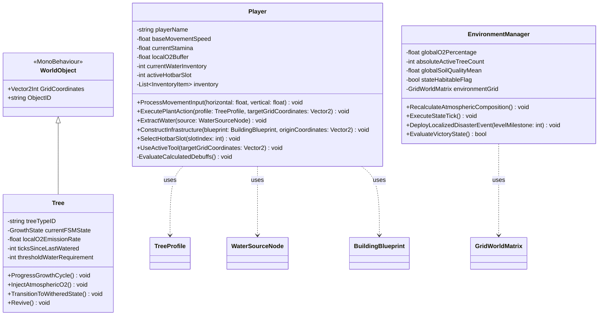

# GEMINI Developer Guidelines - Life on Land

This document defines the system architecture, C# class contracts, design patterns, coding guidelines, and feature implementation details for **Life on Land**, a top-down tactical eco-restoration game.

---

## 1. System Overview & Core Loop

* **Project Name:** Life on Land
* **Genre:** Top-Down Cozy Stage-Based Forest Ecosystem Simulator
* **Platform:** PC / Windows / macOS / Linux
* **Architecture:** Monolithic Client with local serialization persistence (`SaveData.json` / SQLite)
* **Goal:** Rebuild a post-apocalyptic, hyper-arid Earth's biosphere stage-by-stage as the sole surviving *Restorer*, chasing the main villain who is actively destroying the ecosystem.

### Core Game Loop
```
    +------------------------------------------+
    |         Exploration & Collection         | <----------------+
    | (Open Supply Crates, Gather Pond Water)  |                  |
    +------------------------------------------+                  |
                         |                                        |
                         v                                        |
    +------------------------------------------+                  |
    |          Quest & Seed Acquisition        |                  |
    |     (Talk to NPC, Clear Mini-Quest)      |                  |
    +------------------------------------------+                  |
                         |                                        |
                         v                                        |
    +------------------------------------------+                  |
    |          Strategic Planting              |                  | Loop Iteration
    | (Purify Burnt Tiles, Keep Soil Moist)    |                  |
    +------------------------------------------+                  |
                         |                                        |
                         v                                        |
    +------------------------------------------+                  |
    |       Dynamic Environment Update         |                  |
    |  (Reach Local Target O2 & Tree Count)    |                  |
    +------------------------------------------+                  |
                         |                                        |
                         v                                        |
    +------------------------------------------+                  |
    |          Stage Progress Gate             |                  |
    | (Villain Flees, Path Opens to Next Stage)|                  |
    +------------------------------------------+                  |
                         |                                        |
                         +----------------------------------------+
```

---

## 2. Campaign & Stages Specification

The game progresses through a series of stages. Each stage is characterized by a unique aesthetic (tile palette), a local NPC with a distinct personality, and specific quests.

### Stage 1: Red Region (The Arid Oasis)
* **Aesthetic**: Red clay tiles, dry sand, withered red stumps.
* **NPC Representation**: **Maliz** (A Bear Wrath Barbarian; looks incredibly tough and aggressive on the outside, but is actually quite helpless and distressed about their burned forest).
* **Story/Scene**: The opening scene starts here. The Villain appears, burns the remaining oasis trees into corrupted burnt tiles, taunts the player, and departs. Maliz begs for help.
* **NPC Mini-Quest**: Maliz needs water. The player must collect 10 units of water from the deep pond using their empty bucket/can and bring it to Maliz.
* **Reward**: Maliz provides the player with **Desert Shrub Seeds** (Type B - low water need, increases soil moisture retention).
* **Main Stage Quest**: Clear 5 corrupted tiles, plant and grow 5 Desert Shrubs to mature state, bringing the local O2 level to 50.0%.
* **Stage Exit**: The villain appears at the boundary gate, mocks the player's small victory, and flees to the orange region. Maliz unlocks the pathway.

### Stage 2: Orange Region (The Scorched Grove)
* **Aesthetic**: Orange soil, dry leaf litter, dead orange canopy.
* **NPC Representation**: **Oryel** (A Fox Pride Rogue; highly independent, stubborn, and refuses to seek help from other regions because they firmly believe they can fix the damage themselves).
* **Story/Scene**: Oryel is found struggling with widespread fire spots. The Villain has burned their sacred groves. Oryel initially rejects the player's help until the player proves their skills.
* **NPC Mini-Quest**: Oryel demands you reclaim land. Player must shovel and water 5 corrupted burnt tiles to demonstrate purification capabilities.
* **Reward**: Oryel begrudgingly shares **Pine Tree Seeds** (Type A - high O2 emission, high water need) and the **Soil Purifier** blueprint.
* **Main Stage Quest**: Build 1 Soil Purifier, plant and grow 8 Pine Trees to mature state, bringing local O2 to 21.0%.
* **Stage Exit**: The path to the villain's final hideout is revealed.

### Stage 3: The Pink Bloom (Boss Stage)
* **Aesthetic**: Pink petals, rose-tinted mist, glowing moth-lantern flora; deceptively lush but hollow and fragile underneath.
* **NPC Representation**: **Pyper** (A Moth Lust Bard; utterly charming, vain, and theatrical. Convinced their pink region will be spared because they are the most alluring being alive and "can get away with anything." Secretly negotiating a partnership with the Villain — and trying to seduce the player into joining them instead of fighting).
* **Story/Scene**: The Villain is actively present, periodically triggering heatwaves (scorching passes) that double soil moisture evaporation rates. Pyper greets the player warmly, insists the pink region is untouchable, and attempts to allure the player into abandoning the mission and joining their partnership with the Villain.
* **NPC "Temptation" (in place of a Mini-Quest)**: Pyper offers the player everything they need — **Silkmoth Fern Seeds** (Type C - heat-resistant, high O2) and the **Irrigation Pipes** blueprint — as a bribe to switch sides. The player accepts the tools but refuses the offer to join.
* **Main Stage Quest**: Keep plants watered during heatwaves using Irrigation Pipes. Build the **Biosphere Dome** (unique victory building) to finalize the restoration and trap the villain, bringing global O2 to 21.0%.
* **Ending**: The Villain is captured, Pyper realizes they bet on the wrong side, the world begins to turn green, and the victory scene triggers.

---

## 3. Core Systems & Gameplay Mechanics

### A. Minecraft-Style Tool Hotbar
* The player has a fixed hotbar with 6 slots, bound to keyboard keys `1` through `6`.
* **Hotbar Layout**:
  1. **Slot 1 (Shovel/Hoe)**: Digs up corrupted burnt tiles.
  2. **Slot 2 (Watering Can)**: Purifies dug tiles, waters plants. Uses water inventory.
  3. **Slot 3 (Desert Shrub Seed)**: Plants Type B plant.
  4. **Slot 4 (Pine Tree Seed)**: Plants Type A plant.
  5. **Slot 5 (Silkmoth Fern Seed)**: Plants Type C plant.
  6. **Slot 6 (Infrastructure blueprints)**: Places buildings (Soil Purifier, Irrigation Pipes, Biosphere Dome) by selecting through a sub-menu.

### B. Terrain Corruption & Purification
* **Corrupted Burnt Tiles**: Marked with a burnt visual effect. Seeds cannot be planted on them.
* **Two-Step Purification**:
  1. **Step 1 (Shovel)**: Player uses Shovel on the tile. Tile transitions to "Dug Burnt Soil", consuming 5 Stamina.
  2. **Step 2 (Watering Can)**: Player pours water on the tile. Consumes 1 water unit. Tile transitions to clean "Normal Soil".

### C. Soil Moisture & Plant Growth Loop
* **Soil moisture**: Each grid cell has a `moisture` value (0.0 to 1.0).
* **Watering**: Watering a cell sets its moisture to 1.0.
* **Evaporation**: Cell moisture decays over time (e.g., -0.05 every 5 seconds). Heatwaves double this decay rate.
* **Plant Absorption**: Trees absorb moisture from their cell:
  - If cell `moisture > 0`, the plant grows and progresses its FSM.
  - If cell `moisture == 0`, the plant's dehydration timer starts.
* **Growth States**: `Seed` $\rightarrow$ `Sprout` $\rightarrow$ `Mature Tree` $\rightarrow$ `Withered`.
* **Withered Recovery**: If a tree becomes `Withered` due to dehydration, it stops emitting O2. It is **not** permanently lost; watering the tree directly or watering its cell restores it back to its previous growth state.

### D. Survival & Consumables
* **Stamina**: Depleted by movement and tools usage.
* **O2 Buffer**: Depleted when standing in low-O2 tiles (< 18.0%).
* **Replenishment**:
  - Standing in high-O2 zones (> 18.0%) recovers Stamina and O2 buffer.
  - Consuming **Rations** (restores Stamina) and **Purified Water** (restores O2 buffer/Stamina) found in **Supply Crates** hidden around the map.

### E. Dialogue System
* A visual novel style UI box at the bottom of the screen.
* Displays character portraits (Umbra, Villain, Maliz, Oryel, Pyper).
* Triggers at key milestones: Level Start, Quest Assignment, and Stage Completion.

### F. Achievements System
* Accessed via the "Achievements" button in the Pause Menu overlay.
* Tracks campaign and stage milestones (e.g. "First Steps", "Water Bearer", "Green Oasis").
* Uses Reflection to query private quest manager fields dynamically at runtime.

### G. Map Loader & Autotile Preservation
* **Offset Support**: Map files support a `#offset minX maxY` header to automatically shift coordinate grids on export and load.
* **Autotile Overrides**: Neighbor predicates protect custom-painted burnt (`burnt_1`/`0`) and dug (`dug_0`) tiles on start, preventing the autotiler from overriding active gameplay states.

---

## 4. Architectural Guidelines & Best Practices

### C# Coding Style & Unity Rules
1. **Naming Conventions**:
   - Class names, methods, and public properties must use **PascalCase** (e.g. `EnvironmentManager`, `ProcessMovementInput`).
   - Private and local variables must use **camelCase** (e.g. `baseMovementSpeed`, `currentStamina`).
2. **Component References**:
   - Cache Rigidbody2D, Animator, and other standard components in `Start()` or `Awake()`. Avoid calling `GetComponent` dynamically in `Update()` or `FixedUpdate()`.
   - Use `[SerializeField]` to expose private fields in the Inspector, ensuring proper encapsulation.
3. **Physics-Based Calculations**:
   - Character movement and dash velocities should update the Rigidbody2D's velocity (`rb.linearVelocity` in newer Unity versions / Unity 6, or `rb.velocity`).
   - Run physics update ticks in `FixedUpdate` or carefully timed Coroutines (e.g. for dashes).

### Persistence & Data Format
- Serialization occurs locally via JSON (`SaveData.json`) or flat SQLite database.
- Always validate that the schema matches the technical specification's key structure:
  - `save_meta`: Timestamp, level.
  - `environment_state`: O2 levels, tree counts, mean soil quality.
  - `player_state`: Position, inventory arrays.
  - `instantiated_objects`: Unique identifiers, positions, FSM growth states.

### Pixel Art Import Standards
- All character sprites and environment prefabs (e.g. `DeadTree`) must be imported with:
  - **32 Pixels Per Unit (PPU)**
  - **Point (no filter)** filter mode
  - **Uncompressed** compression
- Interactive map objects should use **BottomCenter** alignment/pivot to ensure correct depth-based Y-sorting relative to the player.

### UI & Typography Guidelines
- **Typography Sizes**: Dialogue content and titles must use matching pixel-perfect sizes:
  - Dialog/Pause Title headers: `22` to `24`
  - Button and menu labels: `15` to `18`
  - Description and status text: `14`
- **Layout Scaling**: Keep `localScale = (1, 1, 1)` and use standard font sizes for layout group children to avoid clipping and spacing layout group anomalies.

---

## 5. Core Class Specifications

### Class Diagram


### `Player` Class
Handles input processing, stamina, inventory management, crafting/planting actions, hotbar tool selection, and stamina/debuff evaluation.
```csharp
public class Player : MonoBehaviour {
    [SerializeField] private string playerName;
    [SerializeField] private float baseMovementSpeed = 5f;
    [SerializeField] private float currentStamina;
    [SerializeField] private float localO2Buffer;
    [SerializeField] private int currentWaterInventory;
    [SerializeField] private int activeHotbarSlot = 0; // 0 to 5
    [SerializeField] private List<InventoryItem> inventory;

    public void ProcessMovementInput(float horizontal, float vertical);
    public void SelectHotbarSlot(int slotIndex);
    public void UseActiveTool(Vector2 targetGridCoordinates);
    public void ExecutePlantAction(TreeProfile profile, Vector2 targetGridCoordinates);
    public void ExtractWater(WaterSourceNode source);
    public void ConstructInfrastructure(BuildingBlueprint blueprint, Vector2 originCoordinates);
    private void EvaluateCalculatedDebuffs();
}
```

---

## 6. MVP Feature Checklists

### [MVP-01] Movement & Input Handling & Hotbar
* Fixed/constrained 2D orthographic top-down perspective.
* WASD or Arrow Keys for movement.
* Number keys `1` to `6` to switch active tools.
* Space / Mouse-Click executes the tool on the highlighted grid tile.

### [MVP-02] Dynamic Environment & Localized O2 System
* Global O2 tracking begins at $15.0\%$ in Stage 1.
* Area-grid checks apply a movement speed penalty in low-O2 zones (< 18% O2).
* Visual indicators (shaders) transition from a brown/sepia/burnt tone to vibrant greens as O2 levels recover.

### [MVP-03] Strategic Reforestation Engine & Mini-Quests
* NPC Mini-Quest systems for Maliz and Oryel to earn initial seed bags.
* Two-step tile purification system (Shovel then Water).
* Soil moisture grid tracking and moisture decay over time.
* FSM: `Seed` $\rightarrow$ `Sprout` $\rightarrow$ `Mature Tree` $\rightarrow$ `Withered`.
* Reviving withered trees via direct watering.

### [MVP-04] Infrastructure & Progression Gate
* Level stages lock progress until the local NPC quest conditions are satisfied.
* Craftable buildings (Soil Purifier, Irrigation Pipes, Biosphere Dome).
* Stage 3 heatwave events require Irrigation Pipes auto-watering setup to survive.

### [MVP-05] Dialogue & UI
* Screen-bottom Dialogue Panel overlay with character portraits.
* UI HUD showing Stamina bar, O2 Buffer, active hotbar slot, and current quest objectives.
* High-resolution, crisp Pause Menu overlay and Achievements panel tracking milestones in real-time.

### [MVP-06] Victory Conditions
* Global/Stage victory is met when local quest goals are satisfied and the villain escapes/is captured.
* Trapping the villain in the Biosphere Dome in Stage 3 wins the campaign.

---

# Life on Land — Full Game Description

## High Concept

**Life on Land** is a top-down, cozy-yet-tense **eco-restoration simulator** set on a scorched, hyper-arid future Earth. You are the **last Restorer** — the sole survivor trained to rebuild a dead biosphere tile by tile. But you're not alone: a **Villain** is actively torching what little life remains, always one region ahead of you. The game is a chase across three collapsing biomes where every tree you grow is both a puzzle solved and a small act of defiance.

> **Genre:** Top-Down Cozy Stage-Based Forest Ecosystem Simulator
> **Platform:** PC (Windows / macOS / Linux)
> **Perspective:** Fixed 2D orthographic top-down
> **Tone:** Melancholy hope — *Stardew Valley*'s warmth meets a quiet post-apocalyptic road trip.

---

## The Story

### Premise
Generations after the Great Withering, Earth's atmosphere has thinned to a suffocating **15% oxygen**. The forests are ash, the oceans are dust bowls, and the soil itself has turned *corrupted* — burnt, poisoned, and unable to hold life. You are awakened as the **Restorer**, humanity's last-resort program: part gardener, part firefighter, part detective. Your mission is simple and impossible: **make the land breathe again.**

### The Protagonist
**Umbra** (name derived from *ungu* — "purple" — and meaning "shadow") is the player character: the last **Restorer**.
* **Archetype:** Sloth Monk.
* **Personality:** Calm and unhurried, a wandering **traveler** and disciplined **martial artist**. Umbra moves through the dead world with quiet patience, letting the land — and their own restraint — do the talking.

### The Antagonist
Standing against you is **the Villain** — a figure who moves from region to region *deliberately burning the last living things*. They are never quite within reach: they appear at the edge of each stage, mock your small victories, set the world alight, and flee to the next biome. Their motive is the game's central mystery, revealed in fragments through dialogue and the environments they leave behind. The chase gives the cozy loop a **spine of urgency**: you're not just gardening, you're pursuing.

### The Companions
Each region is home to a wounded guardian — an animal-spirit NPC whose personality mirrors their broken landscape:

* **Maliz** — *Bear, Wrath Barbarian.* Looks terrifying and aggressive, but is secretly helpless and grief-stricken over their burned oasis. Teaches you that toughness can be a mask for despair.
* **Oryel** — *Fox, Pride Rogue.* Fiercely independent and stubborn; refuses outside help because they believe they can fix everything alone. You must *prove* yourself before they'll trust you.
* **Pyper** — *Moth, Lust Bard.* Dazzling, vain, and theatrical. Believes the pink region will be spared because their charm lets them "get away with anything," and is quietly brokering a partnership with the Villain — while trying to allure the player into joining them. Not a guardian, but a temptation.

### Emotional Arc
The story moves from **grief → resilience → hope**. Each stage is a small resurrection, culminating in trapping the Villain inside the very life you rebuilt — the world turning green as the screen fades to victory.

---

## The Three Stages

| Stage | Region | Aesthetic | Guardian | Threat |
|-------|--------|-----------|----------|--------|
| **1** | **Red Region** — The Arid Oasis | Red clay, dry sand, withered stumps | **Maliz** (Bear) | Corrupted burnt tiles |
| **2** | **Orange Region** — The Scorched Grove | Orange soil, leaf litter, dead canopy | **Oryel** (Fox) | Widespread fire spots |
| **3** | **Pink Bloom** — Boss Stage | Pink petals, rose mist, moth-lantern flora | **Pyper** (Moth) | Recurring **heatwaves** + temptation |

### Stage 1 — Red Region *(The Arid Oasis)*
**Opening cinematic:** The Villain appears, burns the last oasis trees into corrupted tiles, taunts you, and vanishes. Maliz, trembling behind their fearsome exterior, begs for help.
* **Mini-Quest:** Fetch **10 units of water** from the deep pond with your bucket and bring it to Maliz.
* **Reward:** **Desert Shrub Seeds** (Type B — low water need, *increases soil moisture retention*).
* **Main Quest:** Clear 5 corrupted tiles, grow **5 Desert Shrubs** to maturity, raise local O₂ to **50.0%**.
* **Exit:** The Villain reappears at the boundary gate, mocks your victory, and flees to the Orange Region. Maliz unlocks the path.

### Stage 2 — Orange Region *(The Scorched Grove)*
Oryel is fighting a losing battle against spreading fire and won't accept help until you earn it.
* **Mini-Quest:** Shovel + water **5 corrupted tiles** to prove your purification skills.
* **Reward:** **Pine Tree Seeds** (Type A — high O₂ output, high water need) + the **Soil Purifier** blueprint.
* **Main Quest:** Build **1 Soil Purifier**, grow **8 Pine Trees** to maturity, raise local O₂ to **21.0%**.
* **Exit:** The path to the Villain's final hideout is revealed.

### Stage 3 — Pink Bloom *(Boss Stage)*
The Villain is *present* this time — periodically triggering **heatwaves** that double soil evaporation. But the real twist is **Pyper**, the region's dazzling moth bard, who has struck a deal with the Villain and tries to charm the player into joining them.
* **Temptation (in place of a mini-quest):** Pyper offers you everything you need — **Silkmoth Fern Seeds** (Type C — heat-resistant, high O₂) and the **Irrigation Pipes** blueprint — as a bribe to switch sides. Take the tools; refuse the offer.
* **Main Quest:** Keep plants alive through heatwaves using Irrigation Pipes, then build the **Biosphere Dome** to finalize restoration, **trap the Villain**, and bring global O₂ to **21.0%**.
* **Ending:** The Villain is captured, Pyper realizes they bet on the wrong side, the world turns green, victory scene triggers.

---

## Design Pillars — What Makes It Special

1. **Cozy with stakes** — the farming loop is soothing, but the Villain and the O₂ clock give it forward momentum.
2. **The land is a character** — corruption, moisture, and O₂ make terrain something you *invest in and are rewarded by*, not just walk across.
3. **Failure is forgiving** — withered trees revive, so the game encourages experimentation over punishment.
4. **Personality through biomes** — each region's guardian embodies its landscape's wound (rage, pride, exhaustion), tying emotion to mechanics.
5. **Restoration you can see** — the shader shift from ash to green is the entire fantasy made visible; the areas you heal become the areas that heal you.

### The Three Plant Archetypes (Strategy Summary)
| Type | Species | Trait | Role |
|------|---------|-------|------|
| **A** | Pine Tree | High O₂ emission, high water need | Powerful but thirsty engine |
| **B** | Desert Shrub | Low water need, boosts neighboring soil retention | Support plant that stabilizes moisture |
| **C** | Silkmoth Fern | Heat-resistant, high O₂ | Only viable species in the Pink Bloom |

Species choice becomes a **spatial puzzle**: Shrubs stabilize moisture so thirsty Pines survive between waterings.

---

## Demo Dialogue Script

Short, digestible lines to carry the story across the demo. Format: **Speaker:** line. Each stage has three beats — **Opening**, **Quest / Assignment**, and **Completion**.

### Stage 1 — Red Region (Maliz)
**Opening** *(Villain burns the last oasis trees)*
> **Villain:** The last green speck on a dead world. How... sentimental.
> **Villain:** *(sets the trees alight)* There. Cleaner already. Chase me if you like, little Restorer.
> **Maliz:** *(roars, then sniffles)* ...You're the Restorer, aren't you? Please — I couldn't stop them. My oasis is gone.

**Quest — Fetch water**
> **Maliz:** The pond runs deep to the east. Bring me ten cans of water, and I'll give you my last seeds — Desert Shrubs. They hold moisture. Hurry.

**Completion**
> **Maliz:** You actually did it. The green... it's coming back.
> **Villain:** *(at the gate)* A handful of shrubs? Adorable. I'll be in the Orange Grove — do try to keep up.

### Stage 2 — Orange Region (Oryel)
**Opening**
> **Oryel:** Don't. I don't need help — least of all from a wandering "Restorer." I fix my own groves.

**Quest — Prove yourself**
> **Oryel:** Fine. Want to be useful? Purify five burnt tiles. Shovel, then water. Can't manage that? Then don't waste my time.

**Completion**
> **Oryel:** ...Not bad. Here — Pine seeds, and a Soil Purifier blueprint. Thank you. The trail past the ridge leads to their hideout.

### Stage 3 — Pink Bloom (Pyper — Boss Stage)
**Opening**
> **Pyper:** Mmm, a visitor~ You must be the famous Restorer. Relax, darling — my region is perfectly safe. Beauty like ours doesn't get burned. We get... arrangements.

**Temptation — Join us**
> **Pyper:** The Villain and I have an understanding. Why struggle in the ash when you could shine beside us? Here — seeds, pipes, everything you need. Join me, and this pink paradise is yours.
> **Umbra:** *(refuses)*
> **Pyper:** ...Pity. Then let's see if your little dome can outlast the heat, hero.
> **Villain:** Charmed already? Pyper sold this whole region for a seat beside me. Loyalty is so cheap when the world is dying.

**Completion**
> **Villain:** *(sealed inside the Dome)* Impossible... you built a *world* around me—
> **Pyper:** *(softly)* Maybe I bet on the wrong side. Maybe... maybe I can still bloom too.
