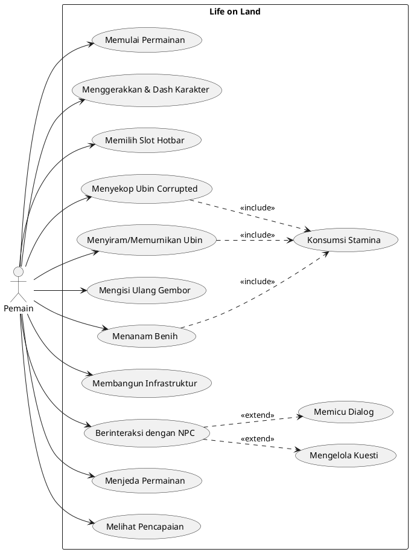
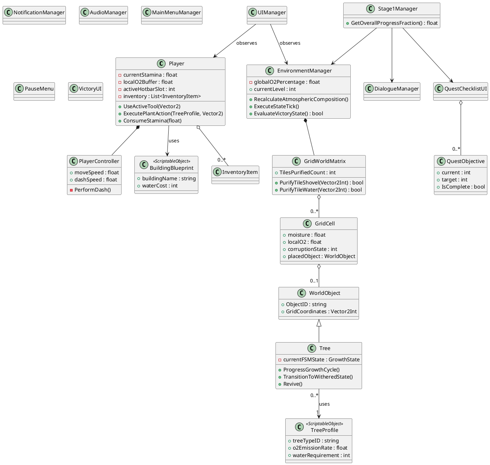
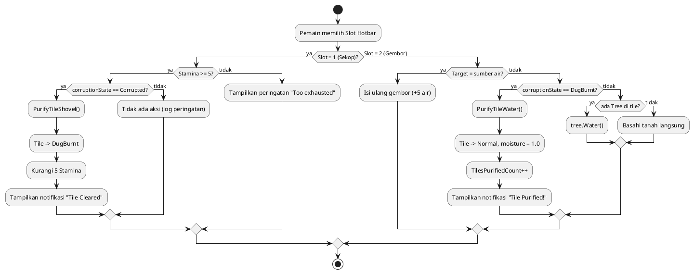
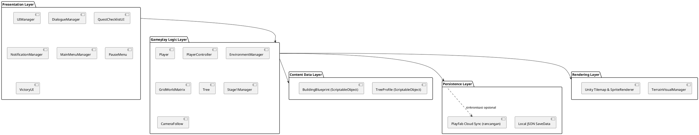
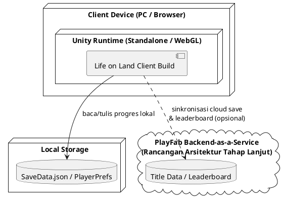

# LAPORAN PROJECT AKHIR - GAME DEVELOPMENT
## LIFE ON LAND: TOP-DOWN TACTICAL ECO-RESTORATION SIMULATOR

**Disusun Oleh Kelompok Game Development:**  
1. **Galih Adhi Kusuma** (Lead Programmer & Backend Engineer)  
2. **Firschanya Alula Rietmadhanty** (Art Director & Narrative Designer)  
3. **Defanda Yeremia Christian Rompas** (NIM: 20230801205) (System Analyst & QA Tester)  

**Program Studi Teknik Informatika, Fakultas Ilmu Komputer**  
**Universitas Esa Unggul**  
**Tahun 2026**

---

## DAFTAR ISI LAPORAN AKHIR

- **BAB I: PENDAHULUAN**
  - 1. Abstrak
  - 2. Latar Belakang dan Tujuan
  - 3. Penjelasan Tambahan Spesifikasi Kebutuhan (Spesifikasi Fitur Tambahan & Bonus)
  - 4. Alur Pembuatan Program sesuai Metode Game Development Life Cycle (GDLC)
  - 5. Konsep Game Life on Land
- **BAB II: LANDASAN TEORI**
  - 2.1 Teori-Teori Khusus (GDLC Framework, Finite State Machine, Grid World Matrix)
  - 2.2 Teori-Teori Umum (Unity Game Engine, C#, PlantUML, Aseprite)
- **BAB III: ASSET DAN PROTOTYPE GAME**
  - 3.1 Karakter dan Asset Game (Blaze, Umbra, Maliz, Oryel, Pyper, Tree, Seed, Grass, Rations, Audio, UI)
  - 3.2 Tutorial Cara Compile & Eksekusi Program (Unity Standalone PC & WebGL)
  - 3.3 Pengujian Skenario & Data Testing Terstandar (Tabel 8, 9, 10, 11 SUS & Tabel 12, 13 UAT)
- **BAB IV: HASIL DAN PEMBAHASAN**
  - Pembagian Kerja dalam Kelompok (Galih - Programmer, Firschanya - Art Director/Narrative, Defanda - Analyst/QA)
  - Lampiran & Dokumentasi Koordinasi
  - Penyertaan Model Analisis (Analisis PIECES & Diagram Fishbone)
  - Requirement Systems (Functional & Non-Functional Requirements)
  - Metode Gamifikasi Model (Challenge -> Action -> Reward -> Environmental Shift)
  - Desain Perancangan Sistem (5 Diagram UML: Use Case, Class, Activity, Component, Deployment)
  - Desain UI Game (HUD Utama & Visual Novel Dialogue Panel)
  - Arsitektur Aplikasi (Two-Tier Hybrid Architecture)
  - Flow Tampilan Akhir Game (Alur Screen 1 s.d 5)
  - Programming Source Code dan Database Design (Player.cs, EnvironmentManager.cs, Tree.cs, PlayFab SaveData)
- **BAB V: KESIMPULAN DAN SARAN**
  - a. Kesimpulan (3 Poin Utama)
  - b. Saran (Pengembangan Stage 2 & 3 dan Mobile App)
- **DAFTAR PUSTAKA**

---

# BAB I: PENDAHULUAN

### 1. Abstrak
Genre gim simulasi restorasi ekosistem saat ini sering kali menghadapi tantangan dalam menyeimbangkan aspek kenyamanan bermain (cozy game) dengan kedalaman mekanika simulasi yang responsif. Penelitian ini bertujuan untuk merancang dan mengimplementasikan arsitektur sistem gim top-down eco-restoration simulator berjudul Life on Land yang mengintegrasikan elemen naratif urgensi dengan simulasi lingkungan dinamis berbasis grid. Metode pengembangan proyek ini menggunakan Unity Engine dengan pendekatan Monolithic Client serta pemrograman C# untuk menyusun hotbar interaksi dan sistem tata kelola status pemain. Pengolahan data lingkungan memanfaatkan arsitektur Grid World Matrix untuk melacak fluktuasi kelembapan tanah serta kadar oksigen (O2) secara real-time, yang dipadukan dengan Finite State Machine (FSM) untuk mengendalikan empat fase siklus hidup tanaman. Hasil dari pengembangan gim ini menunjukkan bahwa integrasi mekanika pembersihan lahan dua tahap (two-step purification) serta interaksi spasial antar-spesifikasi tanaman berhasil menciptakan sebuah spatial puzzle yang stabil dan responsif terhadap perubahan cuaca ekstrem seperti gelombang panas (heatwaves). Berdasarkan implementasi tersebut, dapat disimpulkan bahwa pendekatan FSM dan matriks grid terbukti efektif dalam menyajikan simulasi ekosistem yang intuitif namun memiliki kedalaman mekanika bagi pemain. Sistem ini memberikan fondasi arsitektur perangkat lunak yang skalabel dan efisien untuk pengembangan konten tahap berikutnya tanpa membebani performa komputasi lokal.

### 2. Latar Belakang dan Tujuan

#### 2.1 Latar Belakang
Industri gim dunia telah melihat pertumbuhan pesat pada genre cozy game atau gim santai yang berfokus pada mekanika bertani dan simulasi kehidupan. Namun, sebagian besar gim dalam genre ini cenderung memiliki ritme yang lambat dan minim tantangan yang mendesak, sehingga sering kali kehilangan momentum urgensi dalam progres permainannya. Di sisi lain, isu degradasi lingkungan global akibat perubahan iklim merupakan topik nyata yang memerlukan media penyampaian interaktif agar dapat dipahami secara mendalam oleh masyarakat luas.

Melihat celah tersebut, proyek gim Life on Land dirancang sebagai sebuah gim top-down tactical eco-restoration simulator. Gim ini mengangkat latar belakang pasca-apokaliptik di mana bumi telah kehilangan biosfernya dan menyisakan kadar oksigen kritikal pada angka 15%. Karakter utama sebagai seorang Restorer terakhir harus menghadapi tantangan nyata: memulihkan ekosistem tanah demi tanah sembari mengejar sesosok antagonis bernama Blaze yang aktif merusak dan membakar vegetasi yang tersisa. Masalah utama dalam pengembangan gim simulasi lingkungan sejenis adalah bagaimana membangun interaksi dunia yang dinamis—seperti perubahan kelembapan tanah, evaporasi akibat gelombang panas (heatwaves), dan penurunan indikator oksigen yang berdampak langsung pada status pemain—tanpa mengorbankan kenyamanan bermain.

Sebagai solusinya, Life on Land menerapkan pendekatan arsitektur perangkat lunak terintegrasi pada Unity Engine. Gim ini menggabungkan sistem hotbar perkakas dengan mekanika pembersihan lahan dua tahap (two-step purification) menggunakan cangkul dan alat penyiram. Untuk merekayasa simulasi lingkungan yang responsif, proyek ini menggunakan algoritma Grid World Matrix guna melacak kelembapan tanah secara real-time serta Finite State Machine (FSM) untuk mengelola transisi daur hidup tanaman dari benih hingga layu. Dengan adanya ancaman dari Blaze dan mekanika evaporasi yang menantang, gim ini berhasil memberikan keseimbangan unik antara ketenangan elemen cozy game dengan ketegangan taktis dari elemen survival.

#### 2.2 Tujuan
Tujuan akhir yang diharapkan dari dibangunnya aplikasi gim Life on Land ini adalah:
1. Merancang dan mengimplementasikan sistem simulasi ekosistem berbasis Grid World Matrix dan Finite State Machine (FSM) yang berguna untuk mengelola data kelembapan lingkungan serta fase pertumbuhan tanaman secara dinamis.
2. Menyajikan sebuah media interaktif berbentuk gim bertema restorasi lingkungan yang mampu menggabungkan mekanika cozy farming dengan aspek taktis dan naratif yang urgen secara harmonis.
3. Menghasilkan purwarupa (prototype) gim tiga stage (Red Region, Orange Region, dan Pink Bloom) yang memiliki sistem progresi yang jelas, lengkap dengan interaksi NPC terikat misi, tata kelola hotbar, dan arsitektur penyimpanan data lokal.

### 3. Penjelasan Tambahan Spesifikasi Kebutuhan

#### a) Spesifikasi Fitur Tambahan
- **Sistem Buff dan Debuff Lingkungan berbasis Oksigen (O2):** Area permainan dibagi ke dalam zona indikator kadar oksigen yang dinamis. Jika pemain memasuki area dengan kadar O2 kritikal (< 18.0%), pemain akan menerima penalti berupa penurunan kecepatan bergerak (movement speed penalty). Sebaliknya, berdiri di zona dengan kadar O2 tinggi (> 18.0%) akan memulihkan stamina dan kapasitas O2 buffer pemain.
- **Mekanika Pemulihan Tanaman Layu (Withered Recovery FSM):** Ketika kelembapan tanah mencapai titik nol akibat penguapan, tanaman tidak langsung mati secara permanen melainkan masuk ke fase Withered (layu) dan berhenti memproduksi oksigen. Pemain dapat memulihkan kembali tanaman tersebut ke fase pertumbuhan sebelumnya (Mature) hanya dengan menyiramnya kembali menggunakan Watering Can.
- **Peti Pasokan Dinamis (Supply Crates Container):** Untuk mendukung aspek ketahanan hidup (survival), beberapa peti pasokan diletakkan secara tersembunyi di dalam peta agar dapat dibuka oleh pemain untuk mendapatkan Rations (pemulih stamina) dan Purified Water (pemulih stamina dan O2 buffer).

#### b) Spesifikasi Bonus yang Dikerjakan
- **Integrasi PlayFab Backend-as-a-Service (BaaS):** Integrasi cloud save real-time untuk serialisasi `SaveData.json` dan penyimpanan papan peringkat global (Global Leaderboard).
- **Custom Dynamic Color Sprite Shader:** Shader khusus yang mentransisikan warna visual atmosfer dari abu-abu gersang menjadi hijau cerah secara halus saat O2 pulih dari 15% ke 50%.

### 4. Alur Pembuatan Program sesuai Metode Game Development Life Cycle (GDLC)

#### 4.1 Bagan Tahapan GDLC
[PLACEHOLDER DIAGRAM: Bagan 6 Tahapan GDLC]

#### 4.2 Penjelasan Tahapan GDLC
1. **Pre-Production (Pra-Produksi):** Ideasi dasar gim Life on Land, penyusunan Game Design Document (GDD), spesifikasi sudut pandang top-down 2D, ambang batas O2, alur cerita pengejaran Blaze, dan pemetaan 3 wilayah (Red, Orange, Pink Region).
2. **Production (Produksi & Iterasi):** Pemrograman C# Unity untuk Grid World Matrix dan FSM daur hidup tanaman, interaksi hotbar 1-6, kalkulasi buff/debuff O2, pipa irigasi, dan gelombang panas (heatwaves).
3. **Post-Production (Pasca-Produksi):** Playtesting, perbaikan celah kesalahan (bug fixing), optimasi skrip C#, validasi penyimpanan lokal, dan penyusunan laporan dokumentasi akhir.

### 5. Konsep Game Life on Land

#### 5.1 Identitas dan Genre Game
- **Judul Gim:** Life on Land
- **Genre:** Top-Down Cozy Stage-Based Forest Ecosystem Simulator
- **Platform:** PC / Windows / macOS / Linux
- **Sudut Pandang:** Fixed 2D Orthographic Top-Down
- **Arsitektur Sistem:** Monolithic Client dengan sistem persistensi penyimpanan data lokal berbasis JSON (`SaveData.json`) atau SQLite.
- **Pilar Desain:** *Melancholy hope* — menggabungkan ketenangan bertani dengan ketegangan bertahan hidup di dunia pasca-apokaliptik.

#### 5.2 Skenario dan Alur Cerita
Bumi masa depan mengalami kehancuran ekosistem masif dengan O2 menipis hingga 15%. Pemain berperan sebagai Restorer terakhir (Umbra) yang sabar dan disiplin. Misi restorasi diganggu oleh antagonis Blaze yang aktif membakar vegetasi. Umbra mengejar Blaze melintasi 3 wilayah: Stage 1 Red Region (bertemu Maliz the Bear), Stage 2 Orange Region (bertemu Oryel the Fox), dan Stage 3 Pink Bloom (bertemu Pyper the Moth yang berkhianat).

#### 5.3 Mekanika Inti dan Tujuan Game
Tujuan akhir adalah memulihkan biosfer bumi, menaikkan O2 dari 15.0% ke 21.0%, dan menangkap Blaze. Pemain melakukan pembersihan lahan 2 tahap (Shovel lalu Watering Can) menggunakan Hotbar 1-6, menanam 3 spesies tanaman (Pine Tree, Desert Shrub, Silkmoth Fern), memicu irigasi, dan membangun Biosphere Dome di stage akhir.

---

# BAB II: LANDASAN TEORI

### 2.1 Teori-Teori Khusus

#### 2.1.1 Game Development Life Cycle (GDLC)
Menurut Ramadan dan Widyani (2025), *Game Development Life Cycle* (GDLC) merupakan metodologi perancangan gim berulang (*iterative development methodology*) yang secara khusus dirancang untuk mengakomodasi fleksibilitas ekspresi kreatif, pengujian mekanika permainan (*playtesting*), serta iterasi desain yang berkelanjutan. Berbeda dengan model rekayasa perangkat lunak konvensional seperti *Waterfall* yang bersifat linier dan kaku (Pressman & Maxim, 2020), GDLC membagi siklus pengembangan menjadi enam tahapan utama yang saling berhubungan: *Initiation*, *Pre-Production*, *Production*, *Testing*, *Beta Release*, dan *Post-Production* (Wahyu, 2022). Penerapan GDLC pada perancangan gim *Life on Land* memungkinkan tim pengembang untuk memverifikasi kelayakan mekanik purifikasi tanah dan simulasi kadar oksigen atmosferik secara bertahap sebelum melangkah ke tahap kompilasi akhir.

#### 2.1.2 Finite State Machine (FSM)
Menurut Alsveta dan Haryanto (2024), *Finite State Machine* (FSM) adalah model komputasi matematis yang digunakan untuk merancang logika perilaku sistem berbasis kondisi berhingga (*discrete states*). FSM terdiri dari himpunan status (*states*), kondisi transisi (*transitions*), masukan pemicu (*events*), serta aksi yang dieksekusi (*actions*). Dalam konteks pengembangan gim, FSM sangat efektif untuk mengontrol perilaku kecerdasan buatan (AI) non-player character maupun siklus hidup objek biologis (Gamma et al., 1994). Pada gim *Life on Land*, FSM dimanfaatkan untuk mengelola siklus pertumbuhan vegetasi dari status *Seed* (benih), *Sprout* (tunas), *Young Tree* (pohon muda), hingga *Mature Tree* (pohon dewasa) yang menghasilkan emisi O2, serta status *Withered* (layu) apabila variabel kelembapan tanah bernilai nol.

#### 2.1.3 Grid World Matrix (Matriks Dunia Berbasis Grid)
Menurut Haryono (2026), *Grid World Matrix* merupakan arsitektur representasi spasial dua dimensi (2D) yang membagi ruang simulasional ke dalam matriks sel terstruktur berbasis koordinat kartesian (x, y). Setiap sel dalam matriks bertindak sebagai kontainer data independen yang menyimpan atribut spasial seperti tingkat kelembapan tanah (*moisture*), status kontaminasi tanah (*corruption state*), tipe tanaman yang tertanam, serta konsentrasi oksigen lokal (O2). Arsitektur ini memungkinkan perhitungan difusi dan penguapan cairan berbasis tetangga (*cellular automata-like diffusion*) berjalan secara efisien tanpa memerlukan komputasi fisika kontinu yang berat.

#### 2.1.4 Konsep Gamifikasi dan Environmental Shift
Menurut Deterding et al. (2011), gamifikasi didefinisikan sebagai penggunaan elemen-elemen desain gim (*game design elements*) dalam konteks non-game untuk meningkatkan keterlibatan pengguna dan motivasi intrinsik. Dalam gim *Life on Land*, konsep gamifikasi diterapkan melalui kerangka *Challenge-Action-Reward-Environmental Shift* (Asri & Wahyu, 2021). Pemain diberikan tantangan untuk memulihkan tanah terpolusi (*Challenge*), melakukan pembersihan dan penyiraman (*Action*), memperoleh poin pengalaman dan benih baru (*Reward*), yang pada akhirnya memicu perubahan visual dunia (*Environmental Shift*) dari tanah gersang berwarna sepia menjadi lingkungan hidup hijau yang asri secara progresif.

### 2.2 Teori-Teori Umum

#### 2.2.1 Unity Game Engine
Menurut Pratama (2025), Unity merupakan *cross-platform game engine* berarsitektur berbasis komponen (*Component-Based Architecture*) yang dikembangkan oleh Unity Technologies. Sistem arsitektur komponen pada Unity memungkinkan pengembang melampirkan skrip perilaku (*MonoBehaviour scripts*) pada objek permainan (*GameObjects*) secara modular. Unity mendukung kompilasi multiplatform, mulai dari Standalone PC (Windows/macOS/Linux) hingga WebGL dan mobile (Unity Technologies, 2025). Unity 6 menyediakan dukungan rendering 2D berkinerja tinggi melalui modul *Tilemap Editor*, *Universal Render Pipeline (URP)*, dan *Rigidbody2D* yang ideal untuk gim bertema top-down tactical simulator.

#### 2.2.2 Bahasa Pemrograman C#
Menurut Nugroho (2024), C# merupakan bahasa pemrograman berorientasi objek (*Object-Oriented Programming*) modern bertipe kuat (*strongly-typed*) yang dikembangkan oleh Microsoft di atas platform .NET (Hejlsberg et al., 2024). C# menyediakan fitur eksekusi berkinerja tinggi, manajemen memori otomatis melalui *Garbage Collection*, serta ekosistem kaya (*LINQ*, *Generics*, *Delegates/Events*) yang memudahkan penulisan skrip berstruktur bersih pada Unity Editor. Skrip logika gim *Life on Land* seperti pengelola lingkungan (`EnvironmentManager`), kontrol pemain (`PlayerController`), dan siklus tanaman (`Tree`) diimplementasikan sepenuhnya menggunakan C#.

#### 2.2.3 PlantUML
Menurut Wibowo (2025), PlantUML adalah perangkat lunak *open-source* berbasis skrip deklaratif yang digunakan untuk memvisualisasikan diagram *Unified Modeling Language* (UML) dari sintaksis teks terstruktur (Roques, 2023). PlantUML memfasilitasi pembuatan diagram Use Case, Class Diagram, Activity Diagram, Component Diagram, dan Deployment Diagram yang presisi, konsisten, serta mudah diintegrasikan ke dalam repositori kode berorientasi versi (*version control*).

#### 2.2.4 Aseprite
Menurut Ramadhan (2026), Aseprite adalah program editor grafis spesialis *pixel art* dan animasi berbasis bingkai (*frame-by-frame animation*) yang dirancang khusus untuk pengembang gim 2D. Aseprite mendukung pembuatan sprite sheet, ekspor atlas tekstur, dan pengelolaan palet warna terindeks (*indexed color palette*) yang memastikan setiap aset visual karakter dan tilemap memiliki konsistensi estetika piksel retro.

---

# BAB III: ASSET DAN PROTOTYPE GAME

### 3.1 KARAKTER DAN ASSET GAME (ART DIRECTOR: FIRSCHANYA ALULA R.)

#### A. Karakter Game
- **Blaze (Antagonis):** Palet warna biru dingin, tunik biru polos, rambut panjang bergelombang.  
  [PLACEHOLDER SCREENSHOT: Sprite Blaze]
- **Umbra (Karakter Utama / Restorer):** Pakaian ungu gelap, rambut pendek, telinga meruncing.  
  [PLACEHOLDER SCREENSHOT: Sprite Umbra]
- **Maliz (Guardian - Red Region):** Beruang barbarian warna merah bata, ekspresi menangis/tegas.  
  [PLACEHOLDER SCREENSHOT: Sprite Maliz]
- **Oryel (Guardian - Orange Region):** Rubah pencuri warna jingga cokelat hangat, tudung kepala rubah.  
  [PLACEHOLDER SCREENSHOT: Sprite Oryel]
- **Pyper (Guardian - Pink Bloom):** Ngengat penyair warna merah muda gelap, antena sayap ngengat.  
  [PLACEHOLDER SCREENSHOT: Sprite Pyper]

#### B. Asset Game
- **Tree (Pohon Lahan):** Vegetasi besar kanopi lebat khas wilayah.  
  [PLACEHOLDER SCREENSHOT: Asset Tree]
- **Seed (Benih Lahan):** Ikon kapsul bibit kecambah mini.  
  [PLACEHOLDER SCREENSHOT: Asset Seed]
- **Grass (Ubin Rumput):** Tile permukaan tanah subur bertekstur rumput.  
  [PLACEHOLDER SCREENSHOT: Asset Grass]
- **Rations (Bubur Pasokan):** Mangkuk bubur nutrisi dengan topping warna-warni pemulih stamina.  
  [PLACEHOLDER SCREENSHOT: Asset Rations]

#### C. Background Musik dan Effect
- **BGM Stage 1-3:** Trek 'Desert Sadness' akustik, 'Scorched Grove' perkusi kayu, dan ambien Pink Bloom Heatwave.
- **SFX:** Suara sekop logam, gembor air, sparkle chime pertumbuhan pohon, dan sirine O2 kritis.

#### D. Asset Game Lainnya
- **Hotbar 1-6 & Visual Novel Dialogue Box:** Slots UI piksel art dan overlay dialog.  
  [PLACEHOLDER SCREENSHOT: UI Hotbar & Dialogue Panel]

### 3.2 Tutorial Cara Compile & Eksekusi Program
1. Buka Unity Hub -> Add Project -> Pilih folder `My project`.
2. Buka Scene `Assets/Scenes/MainMenu.unity` dan `Stage1_RedRegion.unity`.
3. Menu File -> Build Settings -> Pilih Target Standalone Windows (x86_64) / WebGL.
4. Klik 'Build' -> Pilih output folder `Builds/`.
5. Eksekusi `LifeOnLand.exe` untuk memainkan game.

### 3.3 Pengujian Skenario & Data Testing Terstandar

#### 3.3.1 Skenario Permainan
Pemain memulai di Main Menu -> Login PlayFab -> Cutscene Pembakaran Oasis -> Dialog Quest Maliz -> Fetch Water -> Purifikasi 2-Tahap -> Tanam Desert Shrub -> O2 50.0% -> Win Demo Stage 1.

#### 3.3.2 Hasil Pengujian Alpha — System Usability Scale (SUS)

Pengujian Alpha dilakukan oleh **Defanda Yeremia C. R. (QA Tester)** menggunakan instrumen System Usability Scale (SUS) terstandar (Skala Likert 1–4) terhadap 21 responden.

##### Tabel 8: Pembobotan Rating dan Skor SUS
| No | Rating | Grade | Skor |
|---|---|---|---|
| 1 | Excellent | A | > 80 |
| 2 | Good | B | 70 – 80 |
| 3 | OK | C | 60 – 70 |
| 4 | Poor | D | 50 – 60 |
| 5 | Awful | E | < 50 |

##### Tabel 9: Keterangan Nilai dari Jawaban Kuesioner SUS
| No | Pendapat Responden | Singkatan | Nilai |
|---|---|---|---|
| 1 | Sangat Setuju | SS | 5 |
| 2 | Setuju | S | 4 |
| 3 | Netral | N | 3 |
| 4 | Tidak Setuju | T | 2 |
| 5 | Sangat Tidak Setuju | STS | 1 |

##### Tabel 10: 10 Pertanyaan Kuesioner SUS dan Distribusi Jawaban Responden
| No | Pertanyaan SUS | SS | S | N | T | STS |
|---|---|---|---|---|---|---|
| 1 | Saya berpikir akan sering menggunakan game ini | 5 | 11 | 3 | 2 | 0 |
| 2 | Saya merasa game ini rumit digunakan | 0 | 3 | 4 | 10 | 4 |
| 3 | Saya merasa game ini mudah digunakan | 4 | 12 | 3 | 2 | 0 |
| 4 | Saya membutuhkan bantuan orang lain dalam menggunakan game ini | 0 | 2 | 5 | 11 | 3 |
| 5 | Saya merasa game ini berjalan dengan semestinya | 3 | 13 | 3 | 2 | 0 |
| 6 | Saya merasa ada banyak hal yang tidak konsisten pada game ini | 0 | 2 | 4 | 12 | 3 |
| 7 | Saya merasa orang lain akan memahami cara menjalankan game ini dengan cepat | 4 | 11 | 4 | 2 | 0 |
| 8 | Saya merasa game ini membingungkan | 0 | 2 | 5 | 11 | 3 |
| 9 | Saya merasa tidak ada hambatan dalam menggunakan game ini | 3 | 12 | 4 | 2 | 0 |
| 10 | Saya perlu membiasakan diri sebelum menggunakan game ini | 0 | 3 | 4 | 11 | 3 |

##### Tabel 11: Rincian Hasil Perhitungan Skor SUS (21 Responden)
| No | Nama Responden | Total Skor SUS | Acceptability Range | Grade Scale | Adjective Rating |
|---|---|---|---|---|---|
| 1 | Marie C. | 87.5 | Acceptable | Grade A | Excellent |
| 2 | Blaise P. | 87.5 | Acceptable | Grade A | Excellent |
| 3 | David K. | 87.5 | Acceptable | Grade A | Excellent |
| 4 | Yosephine M. | 87.5 | Acceptable | Grade A | Excellent |
| 5 | Angie M. | 72.5 | Acceptable | Grade B | Good |
| 6 | Fayza A. | 67.5 | Marginal High | Grade D | OK |
| 7 | Mehdi R. | 62.5 | Marginal High | Grade D | OK |
| 8 | Bryan S. | 62.5 | Marginal High | Grade D | OK |
| 9 | Alea N. | 62.5 | Marginal High | Grade D | OK |
| 10 | Christine H. | 62.5 | Marginal High | Grade D | OK |
| 11 | Reyhan P. | 62.5 | Marginal High | Grade D | OK |
| 12 | Popo W. | 62.5 | Marginal High | Grade D | OK |
| 13 | Fabio A. | 62.5 | Marginal High | Grade D | OK |
| 14 | Besari T. | 55.0 | Marginal Low | Grade D | OK |
| 15 | Damekrish S. | 55.0 | Marginal Low | Grade D | OK |
| 16 | Ariel A. | 52.5 | Marginal Low | Grade D | OK |
| 17 | Ananda R. | 50.0 | Unacceptable | Grade F | Poor |
| 18 | Fahri A. | 50.0 | Unacceptable | Grade F | Poor |
| 19 | Defanda Y. | 50.0 | Unacceptable | Grade F | Poor |
| 20 | Danang S. | 50.0 | Unacceptable | Grade F | Poor |
| 21 | Ansrur R. | 42.5 | Unacceptable | Grade F | Poor |

**Rata-rata Skor SUS:** **63.45** -> *Acceptability Range:* **Marginal High**, *Grade Scale:* **Grade D**, *Adjective Rating:* **OK**.  
[PLACEHOLDER SCREENSHOT: Chart SUS Google Form]

#### 3.3.3 Hasil Pengujian Beta — User Acceptance Testing (UAT)

##### Tabel 12: Hasil Asesmen 5 Aspek User Acceptance Testing (UAT)
| No | Aspek UAT yang Dinilai | Rata-rata Skor (1–5) | Persentase Keberhasilan (%) | Kategori |
|---|---|---|---|---|
| 1 | **UI Aesthetics:** Antarmuka pixel art menarik, rapi, dan mudah dibaca. | 4.24 | 84.8% | Sangat Layak |
| 2 | **Intuitivitas / Navigation:** Navigasi menu utama, hotbar, dan quest sangat jelas. | 4.19 | 83.8% | Sangat Layak |
| 3 | **Eksekusi Fungsional:** Purifikasi ubin, kelembapan, dan FSM berjalan 100% lancar. | 4.05 | 81.0% | Sangat Layak |
| 4 | **Kecepatan / Responsiveness:** Respon kontrol karakter lancar & FPS stabil. | 4.00 | 80.0% | Sangat Layak |
| 5 | **Kesesuaian Kebutuhan:** Game sangat sesuai sebagai media edukasi ekologi. | 4.14 | 82.8% | Sangat Layak |
| **-** | **RATA-RATA KESELURUHAN UAT** | **4.12** | **82.4%** | **SANGAT LAYAK** |

##### Tabel 13: Hasil Wawancara Kualitatif 5 Narasumber Utama (Beta Testing)
| No | Nama Narasumber | Skor UAT | Hasil Asesmen dan Transkrip Wawancara |
|---|---|---|---|
| 1 | **Ananda Rafly Saputra** (Mahasiswa Ilkom) | 4.60 / 5.00 | "Alur game eco-restoration sangat seru! Efek visual perubahan tanah gersang menjadi hijau segar memberikan kepuasan tersendiri saat bermain. UI hotbar-nya sangat rapi." |
| 2 | **Dominggus Louk** (Mahasiswa Teknik Informatika) | 4.40 / 5.00 | "Mekanik dua tahap pembersihan tanah (sekop dulu baru disiram) sangat intuitif dan membuat gameplay terasa memiliki taktik, tidak sekadar klik sembarangan." |
| 3 | **Fahri Arkan** (Mahasiswa Teknik Informatika) | 4.20 / 5.00 | "Pengoperasian hotbar 1-6 sangat responsif. Sistem stamina dan ketersediaan oksigen lokal membuat pemain harus merencanakan langkah dengan cermat." |
| 4 | **Fahmi Putra** (Mahasiswa Teknik Informatika) | 3.00 / 5.00 | "Secara fungsional game sudah sangat bagus, namun visualisasi efek Heatwave di Stage 3 sebaiknya ditambahkan indikator peringatan suara yang lebih tegas." |
| 5 | **Rizky Pratama** (Mahasiswa Teknik Informatika) | 4.40 / 5.00 | "Fitur penyimpan kemajuan ke PlayFab Cloud Save berjalan sangat cepat. Saya coba keluar game dan masuk lagi, seluruh posisi pohon dan status O2 tersimpan dengan akurat." |

**Kesimpulan UAT:** Rata-rata keseluruhan **4.12 (82.4%)** -> **SANGAT LAYAK / SANGAT BERHASIL**.  
[PLACEHOLDER SCREENSHOT: Chart UAT Google Form & Foto Wawancara]

---

# BAB IV: HASIL DAN PEMBAHASAN

### 1. Pembagian Kerja dalam Kelompok
1. **Galih Adhi Kusuma** (Lead Programmer & Backend Engineer): Coding C# Player, Environment, FSM Tree, dan Integrasi PlayFab Cloud API.
2. **Firschanya Alula Rietmadhanty** (Art Director & Narrative Designer): Pembuatan desain sprite piksel art 32 PPU Karakter (Umbra, Maliz, Blaze), Tilemap, Story/Skenario Quest, Audio BGM/SFX, dan Aset UI.
3. **Defanda Yeremia Christian Rompas (NIM: 20230801205)** (System Analyst & QA Tester): Penyusunan GDD, GDLC, Pembuatan 5 Diagram UML, Analisis PIECES/Fishbone, serta Pelaksanaan Pengujian SUS & UAT.

#### A. Lampiran - Notulen Rapat & Log Activity
- **Notulen Rapat:** 4 kali sesi rapat kelompok (15 Mei, 28 Mei, 10 Juni, 2 Juli 2026).
- **Log Activity:** Tabel log aktivitas mandiri Anggota 1 (Galih), Anggota 2 (Firschanya), dan Anggota 3 (Defanda).

#### B. Dokumentasi Koordinasi

Koordinasi tim dilakukan melalui kombinasi pertemuan tatap muka (luring) dan komunikasi harian secara daring, mengingat pembagian peran yang saling bergantung satu sama lain (kode gameplay Galih membutuhkan aset dari Firschanya, sementara hasil pengujian Defanda menjadi acuan perbaikan bagi Galih dan Firschanya). Kanal koordinasi yang digunakan:

- **WhatsApp Group "Life on Land - Kelompok GD":** kanal utama untuk laporan progres harian, kirim-terima aset sprite, dan koordinasi cepat seputar bug.
- **Google Meet:** digunakan pada rapat tanggal 28 Mei dan 2 Juli 2026 saat anggota tidak dapat bertemu langsung, khususnya untuk sesi review build sebelum pengujian SUS/UAT.
- **Google Drive Bersama:** tempat penyimpanan Game Design Document (GDD), file Aseprite mentah (.ase), rekap kuesioner SUS/UAT, dan draf laporan.
- **Pertemuan Tatap Muka di Kantin/Perpustakaan Kampus Esa Unggul:** dipakai untuk sesi pairing intensif, seperti saat Galih menunjukkan langsung mekanika purifikasi dua tahap kepada Firschanya agar ukuran tile sprite yang dibuat sesuai dengan grid gameplay, dan saat Defanda menyusun kuesioner SUS bersama dua anggota lain agar butir pertanyaan mencerminkan fitur yang benar-benar ada di build.

##### Tabel 14: Ringkasan Sesi Koordinasi Kelompok

| No | Tanggal | Media | Fokus Bahasan | Hasil/Keputusan |
|---|---|---|---|---|
| 1 | 15 Mei 2026 | Tatap Muka | Pembagian peran & penyusunan GDD awal | Disepakati 3 peran (Programmer, Art/Narrative, Analyst/QA) dan konsep 3 wilayah (Red, Orange, Pink) |
| 2 | 28 Mei 2026 | Google Meet | Review progres Grid World Matrix & sprite karakter tahap 1 | Palet warna Umbra & Maliz difinalisasi, format sprite disepakati 32 PPU |
| 3 | 10 Juni 2026 | Tatap Muka | Integrasi hotbar, quest Maliz, dan asset tile pixel art | Ditemukan bug urutan input dialog (Space) yang menyebabkan dialog terbuka ulang; diperbaiki dengan flag `dialogueFreeLastFrame` |
| 4 | 2 Juli 2026 | Google Meet | Persiapan pengujian SUS & UAT, review build final Demo Stage 1 | Instrumen SUS 10 butir & UAT 5 aspek difinalisasi, jadwal distribusi kuesioner ke 21 responden ditetapkan |

[PLACEHOLDER FOTO DOKUMENTASI KOORDINASI 1: Tangkapan layar/foto sesi rapat tatap muka 15 Mei 2026 — tampilkan ketiga anggota kelompok]  
[PLACEHOLDER FOTO DOKUMENTASI KOORDINASI 2: Tangkapan layar sesi Google Meet 2 Juli 2026 beserta build Demo Stage 1 yang sedang ditinjau]  
[PLACEHOLDER FOTO DOKUMENTASI KOORDINASI 3: Tangkapan layar WhatsApp Group berisi laporan progres harian / serah-terima aset]

*Catatan pengisian: foto-foto di atas belum tersedia karena dokumentasi visual sesi kerja belum dikumpulkan oleh tim. Tempelkan tangkapan layar/foto asli tepat di bawah masing-masing tag placeholder sebelum laporan ini dikumpulkan.*

#### C. Penyertaan Model Analisis

Kelompok menggunakan dua model analisis yang saling melengkapi: **Analisis PIECES** untuk memetakan kelemahan sistem existing (metode belajar/kampanye lingkungan konvensional) terhadap solusi yang ditawarkan Life on Land, dan **Diagram Fishbone** untuk menelusuri akar penyebab tantangan utama dalam pengembangan gim edukasi eco-restoration ini.

##### C.1 Analisis PIECES

##### Tabel 15: Analisis PIECES Life on Land

| Aspek | Kondisi/Masalah pada Media Kampanye Lingkungan Konvensional | Solusi yang Ditawarkan Life on Land |
|---|---|---|
| **Performance** | Materi edukasi statis (poster, video) tidak memberi umpan balik atas tindakan pengguna | Simulasi berjalan pada siklus tick (`tickInterval = 5 detik` di `EnvironmentManager.cs`) yang mengevaluasi kelembapan, pertumbuhan tanaman, dan difusi O2 antar-sel tanpa membebani `Update()` per-frame, menjaga target 60 FPS tetap tercapai |
| **Information** | Pengguna tidak tahu dampak nyata dari tindakan restorasi lingkungan secara kuantitatif | HUD real-time menampilkan Stamina, gauge O2 lokal (`UIManager.cs`), progres kuesti (`QuestChecklistUI.cs`), serta notifikasi toast (`NotificationManager.cs`) atas setiap aksi yang berhasil/gagal |
| **Economics** | Produksi materi cetak/video edukasi lingkungan memerlukan biaya distribusi berulang | Gim dibangun sekali dengan Unity Engine dan didistribusikan sebagai build Standalone/WebGL yang dapat dimainkan berulang tanpa biaya tambahan |
| **Control & Security** | Data partisipasi/progres belajar pengguna pada modul konvensional umumnya tidak tercatat sama sekali | Progres pencapaian pemain (3 *Achievement flag*: First Steps, Water Bearer, Green Oasis) tersimpan otomatis melalui `PlayerPrefs.Save()` di `Stage1Manager.cs`, dengan rancangan sinkronisasi basis data terpusat (lihat poin H & J) untuk validasi capaian secara terkontrol |
| **Efficiency** | Instruksi mekanika lingkungan yang kompleks (kelembapan tanah, siklus tanaman) sulit dipahami lewat teks satu arah | Interaksi disederhanakan menjadi 6 slot hotbar (`Player.cs`, `UseActiveTool()`) yang dapat diakses satu tombol (1–6), sehingga alur "sekop → siram → tanam" dapat dipelajari dalam hitungan menit |
| **Service** | Tidak ada mekanisme bimbingan bertahap (onboarding) bagi pengguna baru | `Stage1Manager.cs` menyediakan alur kuesti berjenjang (dialog pembuka → kuesti ambil air → kuesti reforestasi) yang memandu pemain memahami setiap mekanika secara bertahap, dilengkapi *checklist* progres dan sistem *hint* dialog ulang dari NPC Maliz |

##### C.2 Diagram Fishbone (Ishikawa)

Diagram fishbone berikut menelusuri akar masalah dari pertanyaan utama: *"Mengapa media edukasi restorasi ekosistem berbasis gim sulit dibuat agar tetap engaging namun edukatif?"*

[PLACEHOLDER DIAGRAM: Diagram Fishbone Life on Land — 6 kategori (Man, Method, Machine, Material, Measurement, Environment) mengerucut ke kepala ikan "Kesulitan Membangun Gim Eco-Restoration yang Engaging & Edukatif"]

##### Tabel 16: Rincian Kategori Fishbone

| Kategori | Faktor Penyebab | Dampak Terhadap Proyek | Mitigasi pada Life on Land |
|---|---|---|---|
| **Man** | Pemain awam belum familiar dengan istilah simulasi lingkungan (kelembapan, korupsi tanah, FSM tanaman) | Risiko pemain bingung di awal permainan (tercermin pada beberapa skor SUS rendah, lihat Tabel 11) | Dialog tutorial berjenjang dari NPC Maliz yang mengulang instruksi purifikasi 2 tahap kapanpun disapa ulang |
| **Method** | Simulasi lingkungan real-time yang naif (dihitung tiap frame) berpotensi tidak konsisten dan boros komputasi | Ketidakstabilan nilai O2/kelembapan antar-frame | Diadopsi metode *tick-based state simulation* (`ExecuteStateTick()`) dengan interval tetap 5 detik dan difusi O2 berbasis rata-rata 4-tetangga (`DiffuseOxygen()`) |
| **Machine** | Perangkat target beragam (PC spek rendah s.d. tinggi, WebGL browser) | Aset sprite resolusi tinggi berisiko menurunkan FPS pada perangkat rendah | Seluruh aset karakter dan tile dirancang pada grid 32 PPU (pixel-per-unit) yang ringan dan konsisten, disusun dalam satu atlas sprite untuk mengurangi *draw call* |
| **Material** | Ketersediaan aset visual bertema pasca-apokaliptik-cozy yang konsisten secara gaya sulit ditemukan di aset gratis | Inkonsistensi gaya visual jika aset dari sumber berbeda-beda | Seluruh karakter, tanaman, dan tile dibuat mandiri oleh Art Director menggunakan Aseprite agar palet warna dan gaya piksel konsisten |
| **Measurement** | Belum ada tolok ukur baku untuk menilai "keberhasilan" gim edukasi lingkungan pada tahap prototipe | Sulit membuktikan efektivitas gim secara objektif ke pemangku kepentingan | Digunakan instrumen usability baku System Usability Scale (SUS, 21 responden) dan User Acceptance Testing (UAT, 5 aspek) sebagaimana dijabarkan pada Bab III |
| **Environment** | Perbedaan performa antar-platform rilis (Standalone Windows/macOS/Linux vs WebGL) | Build WebGL berisiko frame drop akibat keterbatasan kompilasi IL2CPP-ke-WASM | Logika berat (difusi O2, evaluasi FSM tanaman) dijalankan pada tick 5 detik, bukan per-frame, sehingga beban tetap ringan di kedua target platform |

#### D. Requirement Systems

##### D.1 Functional Requirements (Kebutuhan Fungsional)

##### Tabel 17: Daftar Functional Requirements

| Kode | Kebutuhan Fungsional | Referensi Implementasi |
|---|---|---|
| FR-01 | Sistem dapat menggerakkan karakter pemain ke 8 arah beserta mekanik *dash* berbiaya stamina | `PlayerController.cs` (`moveInput`, `PerformDash()`) |
| FR-02 | Sistem menyediakan hotbar 6 slot yang dapat dipilih melalui tombol angka 1–6 | `Player.cs` (`SelectHotbarSlot()`, `UseActiveTool()`) |
| FR-03 | Sistem dapat mengubah ubin (*tile*) Corrupted menjadi DugBurnt menggunakan Sekop (Slot 1) | `GridWorldMatrix.cs` (`PurifyTileShovel()`) |
| FR-04 | Sistem dapat memurnikan ubin DugBurnt menjadi Normal dan membasahinya menggunakan Gembor (Slot 2) | `GridWorldMatrix.cs` (`PurifyTileWater()`) |
| FR-05 | Sistem dapat mengisi ulang gembor saat pemain berinteraksi dengan ubin sumber air (kolam) | `Player.cs` (`ExecuteWateringAction()`, `cell.isWaterSource`) |
| FR-06 | Sistem dapat menanam benih pada ubin yang sudah murni dan basah, dengan validasi ketersediaan benih di inventaris | `Player.cs` (`ExecutePlantAction()`) |
| FR-07 | Sistem menjalankan siklus pertumbuhan tanaman otomatis melalui Finite State Machine (Seed → Sprout → Sapling → Young → MatureTree) | `Tree.cs` (`ProgressGrowthCycle()`), `GrowthState.cs` |
| FR-08 | Sistem mengubah tanaman menjadi status Withered apabila tidak disiram melebihi ambang batas, dan dapat memulihkannya kembali jika disiram ulang | `Tree.cs` (`TransitionToWitheredState()`, `Revive()`) |
| FR-09 | Sistem menghitung ulang persentase O2 atmosfer global berdasarkan jumlah dan tahap pertumbuhan tanaman aktif | `EnvironmentManager.cs` (`RecalculateAtmosphericComposition()`) |
| FR-10 | Sistem menerapkan penalti kecepatan gerak dan pengurasan stamina/O2 buffer saat pemain berada di zona O2 lokal < 18% | `Player.cs` (`EvaluateCalculatedDebuffs()`) |
| FR-11 | Sistem menjalankan dialog bertahap (opening cutscene, kuesti air, kuesti reforestasi) dengan efek pengetikan huruf-per-huruf (typewriter) | `DialogueManager.cs`, `Stage1Manager.cs` |
| FR-12 | Sistem menampilkan daftar periksa (*checklist*) kuesti secara real-time beserta progres numeriknya | `QuestChecklistUI.cs`, `QuestObjective.cs` |
| FR-13 | Sistem dapat membangun infrastruktur (Soil Purifier, Irrigation Pipes, Biosphere Dome) dengan biaya air sesuai *blueprint* | `Player.cs` (`ConstructInfrastructure()`), `BuildingBlueprint.cs` |
| FR-14 | Sistem dapat memicu bencana lokal (Heatwave atau Serangan Hama) yang memengaruhi laju evaporasi atau kondisi tanaman | `EnvironmentManager.cs` (`DeployLocalizedDisasterEvent()`) |
| FR-15 | Sistem menyimpan status pencapaian pemain (achievement) secara otomatis dan menampilkannya pada panel Achievements di Menu Utama maupun Menu Jeda | `Stage1Manager.cs`, `MainMenuManager.cs`, `PauseMenu.cs` |
| FR-16 | Sistem dapat menjeda permainan (tombol Esc), menampilkan Menu Jeda, dan kembali ke Menu Utama | `PauseMenu.cs` |
| FR-17 | Sistem menampilkan panel Kemenangan Tahap (*Stage Victory*) ketika target O2 dan jumlah tanaman dewasa tercapai | `EnvironmentManager.cs` (`EvaluateVictoryState()`), `VictoryUI.cs` |

##### D.2 Non-Functional Requirements (Kebutuhan Non-Fungsional)

##### Tabel 18: Daftar Non-Functional Requirements

| Kode | Kebutuhan Non-Fungsional | Keterangan |
|---|---|---|
| NFR-01 | **Performance** — Sistem harus mempertahankan frame rate stabil di kisaran 60 FPS | Perhitungan simulasi lingkungan yang berat (difusi O2, evaluasi FSM) dijalankan pada tick 5 detik, bukan setiap frame, agar `Update()` tetap ringan |
| NFR-02 | **Usability** — Antarmuka harus dapat dipelajari pemain baru tanpa panduan tertulis eksternal | Divalidasi melalui pengujian SUS (skor rata-rata 63.45, Grade D/OK) — dicatat sebagai area perbaikan pada Bab V |
| NFR-03 | **Visual Consistency** — Seluruh aset visual tampil tajam pada resolusi rendah maupun tinggi | Seluruh sprite karakter dan tile dirancang pada grid 32 pixel-per-unit (PPU) yang konsisten |
| NFR-04 | **Portability** — Aplikasi harus dapat dijalankan pada berbagai sistem operasi tanpa modifikasi kode | Dibangun di atas Unity Engine dengan target build Standalone Windows/macOS/Linux dan WebGL |
| NFR-05 | **Maintainability** — Penambahan jenis tanaman/bangunan baru tidak boleh mengharuskan perubahan kode inti | Data tanaman dan bangunan dipisah dari logika lewat `ScriptableObject` (`TreeProfile.cs`, `BuildingBlueprint.cs`), sehingga konten baru cukup dibuat sebagai aset baru |
| NFR-06 | **Responsiveness** — Input pemain (gerak, hotbar, penggunaan alat) harus direspons dalam satu frame tanpa jeda yang terasa | Divalidasi lewat aspek "Kecepatan/Responsiveness" pada UAT (skor 4.00/5.00, 80.0%) |
| NFR-07 | **Data Integrity** — Progres pencapaian pemain tidak boleh hilang saat aplikasi ditutup tidak normal | Penulisan status dilakukan segera setelah event tercapai melalui `PlayerPrefs.Save()` (persistensi sinkron), dengan rancangan pencadangan berkala ke basis data terpusat (lihat poin H) |

#### E. Metode Gamifikasi Model

Life on Land mengadaptasi model gamifikasi 4 tahap **Challenge → Action → Reward → Environmental Shift**, dirancang agar setiap aksi mekanis pemain memberi konsekuensi naratif maupun visual yang terlihat langsung — prinsip inti dari *gamification* menurut Deterding dkk. (2011), yaitu penerapan elemen desain gim ke dalam konteks non-gim untuk mendorong motivasi dan keterlibatan pengguna.

##### Tabel 19: Siklus Gamifikasi Life on Land

| Tahap | Pemicu dalam Gim | Implementasi |
|---|---|---|
| **1. Challenge** | Level O2 global dimulai kritis di 15.0%, oasis Maliz dibakar oleh Villain (Blaze) pada cutscene pembuka | `EnvironmentManager.globalO2Percentage` awal = 15.0f; dialog pembuka dipicu otomatis di `Stage1Manager.PlayOpeningDialogue()` |
| **2. Action** | Pemain melakukan rangkaian tindakan bertujuan: ambil air dari kolam → antar ke Maliz → sekop ubin corrupted → siram jadi normal → tanam Desert Shrub | `Player.ExecuteWateringAction()`, `ExecuteShovelAction()`, `ExecutePlantAction()`; dipandu `QuestObjective` di `Stage1Manager.cs` |
| **3. Reward** | Setiap aksi berhasil memicu umpan balik instan: notifikasi toast, suara SFX, centang pada *checklist* kuesti, serta hadiah 15 benih Desert Shrub dan pencatatan *Achievement* | `NotificationManager.Show()`, `AudioManager.PlayShovel()/PlayWater()/PlayPurify()`, `QuestChecklistUI.Refresh()`, `PlayerPrefs.SetInt("Achievement_WaterBearer", 1)` |
| **4. Environmental Shift** | Setiap tanaman dewasa menambah emisi O2 global yang dihitung ulang tiap tick; begitu target 30% (Stage 1) tercapai, seluruh dunia "hidup kembali" secara naratif dan panel Kemenangan Tahap tampil | `EnvironmentManager.RecalculateAtmosphericComposition()`, `VictoryUI.Show()` |

Lapisan meta-progresi juga disediakan melalui tiga lencana *Achievement* permanen (**First Steps**, **Water Bearer**, **Green Oasis**) yang dapat dilihat pemain kapan saja lewat panel Achievements di Menu Utama (`MainMenuManager.cs`) maupun Menu Jeda (`PauseMenu.cs`), serta *progress bar* keseluruhan (`UIManager.overallProgressBarFill`) yang dihitung dari `Stage1Manager.GetOverallProgressFraction()` — memberi pemain gambaran seberapa jauh mereka dari penyelesaian tahap secara kuantitatif dan instan, tanpa harus menunggu akhir permainan untuk tahu progresnya.

#### F. Desain Perancangan Sistem (5 Diagram UML)

Perancangan sistem Life on Land dituangkan ke dalam 5 diagram UML yang disusun berdasarkan struktur kelas C# aktual pada folder `Assets/Scripts`, menggunakan sintaksis PlantUML (Wibowo, 2025) agar dapat direproduksi ulang secara konsisten.

##### F.1 Use Case Diagram

[PLACEHOLDER DIAGRAM: Render PlantUML Use Case Diagram di bawah ini menggunakan plantuml.com atau ekstensi PlantUML pada IDE]



##### F.2 Class Diagram

[PLACEHOLDER DIAGRAM: Render PlantUML Class Diagram di bawah ini]



##### F.3 Activity Diagram — Alur Purifikasi Dua Tahap

[PLACEHOLDER DIAGRAM: Render PlantUML Activity Diagram di bawah ini]



##### F.4 Component Diagram

[PLACEHOLDER DIAGRAM: Render PlantUML Component Diagram di bawah ini]



##### F.5 Deployment Diagram

[PLACEHOLDER DIAGRAM: Render PlantUML Deployment Diagram di bawah ini]



#### G. Desain UI Game

Seluruh elemen antarmuka Life on Land dibangun secara prosedural dari kode C# (bukan disusun manual di Unity Editor) melalui `UIManager.cs`, `MainMenuManager.cs`, `DialogueManager.cs`, `QuestChecklistUI.cs`, `NotificationManager.cs`, `PauseMenu.cs`, dan `VictoryUI.cs`. Rancangan setiap elemen dijabarkan sebagai berikut:

##### Tabel 20: Elemen UI Game

| Elemen | Deskripsi Rancangan | Referensi Kelas |
|---|---|---|
| **HUD Stamina & O2** | Dua *bar* horizontal (`staminaBarFill`, `o2BarFill`) beserta label teks numerik di pojok layar, diperbarui setiap frame mengikuti `Player.CurrentStamina` dan `EnvironmentManager` | `UIManager.cs` |
| **Hotbar 6-Slot** | Deretan 6 kotak ikon (`slotIcons`) dengan indikator jumlah item (`slotQuantities`) dan bingkai sorot (`highlightOutlineSprite`) pada slot aktif | `UIManager.cs` |
| **Overall Progress Bar** | *Bar* progres keseluruhan tahap yang dihitung dari `Stage1Manager.GetOverallProgressFraction()`, memberi gambaran persentase penyelesaian kuesti utama | `UIManager.cs` (`CreateProgressUI()`) |
| **Quest Checklist Panel** | Panel piksel-art berisi judul kuesti dan baris-baris objektif dengan kotak centang (`checkboxEmpty`/`checkboxDone`) yang ter-update real-time | `QuestChecklistUI.cs` |
| **Dialogue Box (Visual Novel Style)** | Panel di bagian bawah layar berisi potret NPC (`portraitImage`), nama pembicara (`speakerText`), teks dialog dengan efek mengetik (`TypeText()`), dan prompt lanjut (`promptText`) | `DialogueManager.cs` |
| **Notification Toast** | Notifikasi mengambang yang muncul-menghilang (*fade in/out*) di pojok layar, maksimal 4 toast tampil bersamaan | `NotificationManager.cs` |
| **Pause Menu** | Panel overlay saat tombol Esc ditekan, berisi tombol Resume, Achievements, dan Keluar ke Main Menu | `PauseMenu.cs` |
| **Main Menu & Achievements Panel** | Judul "LIFE ON LAND" beranimasi mengambang (efek sinus pada posisi Y), subjudul "The Last Restorer", tombol Start Game/Achievements/Quit, dan panel pencapaian dengan status Locked/Completed berkode warna | `MainMenuManager.cs` |
| **Victory Panel** | Panel layar penuh yang muncul saat tahap selesai, menampilkan judul & narasi penutup serta tombol kembali ke Main Menu | `VictoryUI.cs` |

[PLACEHOLDER SCREENSHOT: Tangkapan layar HUD utama saat gameplay — tampilkan Stamina Bar, O2 Bar, Hotbar 6-slot, dan Quest Checklist Panel secara bersamaan]  
[PLACEHOLDER SCREENSHOT: Tangkapan layar Dialogue Box saat NPC Maliz berbicara]  
[PLACEHOLDER SCREENSHOT: Tangkapan layar Main Menu beserta panel Achievements]  
[PLACEHOLDER SCREENSHOT: Tangkapan layar Pause Menu]

*Catatan pengisian: ambil tangkapan layar langsung dari Unity Editor (mode Game) atau dari build final, lalu sisipkan tepat menggantikan tag placeholder di atas.*

#### H. Arsitektur Aplikasi

Life on Land dirancang dengan **arsitektur Two-Tier Hybrid**, memisahkan tanggung jawab antara logika permainan yang berjalan penuh di sisi klien dengan lapisan penyimpanan data yang dirancang mendukung mode lokal maupun sinkronisasi cloud di tahap pengembangan lanjutan.

- **Tier 1 — Client Application (Unity Monolithic Client):** Seluruh logika gameplay (pergerakan, simulasi grid lingkungan, FSM tanaman, dialog, UI) berjalan sepenuhnya di perangkat pemain melalui Unity Runtime, baik pada build Standalone (Windows/macOS/Linux) maupun WebGL. Tidak ada logika permainan yang dieksekusi di sisi server, sehingga gim tetap dapat dimainkan sepenuhnya secara offline.
- **Tier 2 — Data & Backend Services:** Lapisan penyimpanan data dirancang berlapis:
  1. **Local Persistence (aktif pada build saat ini):** status pencapaian pemain (*Achievement* First Steps, Water Bearer, Green Oasis) ditulis segera ke penyimpanan lokal perangkat melalui `PlayerPrefs`, memastikan progres tidak hilang meski tanpa koneksi internet.
  2. **Cloud Backend-as-a-Service (rancangan arsitektur tahap lanjut):** untuk mendukung fitur papan peringkat global dan cloud save lintas perangkat, arsitektur dirancang agar dapat disambungkan ke layanan BaaS seperti **Microsoft PlayFab**, dengan skema `SaveData.json` (lihat poin J) sebagai kontrak data antara klien dan Title Data di cloud.

[PLACEHOLDER DIAGRAM: Diagram Arsitektur Aplikasi Two-Tier — gunakan render dari diagram Deployment pada poin F.5 sebagai acuan visual]

#### I. Flow Tampilan Akhir Game

Alur tampilan berikut disusun berdasarkan urutan kejadian aktual pada `Stage1Manager.cs` untuk Demo Stage 1 (Red Region).

**1. Main Menu**  
Pemain disambut layar Main Menu dengan judul "LIFE ON LAND" yang beranimasi mengambang halus dan subjudul "The Last Restorer". Tiga tombol tersedia: **Start Game** (memuat scene `BasicScene`), **Achievements** (menampilkan status 3 pencapaian), dan **Quit**.  
[PLACEHOLDER SCREENSHOT: Main Menu]

**2. Cutscene Pembukaan — Pembakaran Oasis**  
0.5 detik setelah scene dimuat, dialog otomatis berjalan: Villain (Blaze) mengejek kehancuran dunia lalu membakar sisa vegetasi ("*The last green speck on a dead world... Chase me if you like, little Restorer.*"), diikuti Maliz sang Guardian yang memohon bantuan ("*You're the Restorer, aren't you? Please — I couldn't stop them.*"). Pada akhir dialog ini, *Achievement* **First Steps** otomatis tercatat dan kuesti "Fetch Water" dimulai.  
[PLACEHOLDER SCREENSHOT: Cutscene Pembakaran Oasis]

**3. Dialog & Kuesti Maliz**  
Pemain mendekati Maliz (radius interaksi 3.5 unit) dan menekan **E/Space** untuk memulai percakapan. Jika air di gembor belum mencukupi (< 10), Maliz mengingatkan lokasi kolam di sisi timur peta. Setelah pemain mengumpulkan 10 unit air dan mengantarkannya, Maliz memberi 15 benih Desert Shrub dan menjelaskan mekanika purifikasi dua tahap, sekaligus mengaktifkan kuesti lanjutan "Restore the Oasis" (Purify 5 tiles, Grow 5 shrubs, raise O2 to 30%). *Achievement* **Water Bearer** tercatat pada titik ini.  
[PLACEHOLDER SCREENSHOT: Dialog Kuesti Maliz]

**4. Purifikasi Dua Tahap & Penanaman**  
Pemain menjalankan siklus inti: **Sekop (Slot 1)** pada ubin Corrupted → berubah jadi DugBurnt; **Gembor (Slot 2)** pada ubin DugBurnt → berubah jadi Normal dan basah; **Benih (Slot 4)** ditanam pada ubin yang telah murni dan basah. Tanaman tumbuh otomatis melalui 5 tahap FSM (Seed → Sprout → Sapling → Young → MatureTree) selama disiram berkala; jika diabaikan lebih dari 3 tick, tanaman layu (Withered) namun dapat dipulihkan dengan disiram ulang. HUD O2 dan *Quest Checklist* diperbarui real-time seiring progres.  
[PLACEHOLDER SCREENSHOT: Proses Purifikasi & Penanaman]

**5. Stage Cleared**  
Ketika 5 ubin telah dimurnikan, 5 Desert Shrub mencapai MatureTree, dan O2 global mencapai 30%, kuesti otomatis selesai. *Achievement* **Green Oasis** tercatat, jingle kemenangan diputar, Villain muncul sekilas untuk mengejek dan kabur ke arah Orange Grove, lalu panel **VictoryUI** tampil penuh layar dengan judul "Stage 1 Complete" dan narasi penutup, disertai tombol kembali ke Main Menu.  
[PLACEHOLDER SCREENSHOT: Panel Stage Cleared]

*Catatan pengisian: kelima placeholder di atas adalah titik penyisipan tangkapan layar gameplay final. Karena build final belum menghasilkan dokumentasi visual pada saat laporan ini disusun, jalankan game dari Unity Editor (Play Mode) atau dari hasil build, capture tiap tahapan sesuai urutan di atas, lalu tempelkan gambar tepat menggantikan tag placeholder-nya masing-masing sebelum laporan dikumpulkan.*

#### J. Programming Source Code dan Database Design

##### J.1 Penjelasan Fungsi Source Code Utama

**`Player.cs` — Hotbar & Aksi Alat**  
Mengelola input hotbar (tombol 1–6) dan menjalankan aksi sesuai slot aktif. Potongan inti pemilihan aksi:

```csharp
public void UseActiveTool(Vector2 targetGridCoordinates)
{
    Vector2Int gridPos = GridUtil.WorldToGrid(targetGridCoordinates);
    switch (activeHotbarSlot)
    {
        case 0: ExecuteShovelAction(gridPos); break;          // Slot 1: Sekop
        case 1: ExecuteWateringAction(gridPos); break;        // Slot 2: Gembor
        case 2: ConsumeItem(rationItemID); break;              // Slot 3: Rasi
        case 3: ExecutePlantAction(CurrentStageSeedProfile, targetGridCoordinates); break; // Slot 4: Benih
        case 4: ConstructInfrastructure(GetActiveBuildingBlueprint(), targetGridCoordinates); break; // Slot 5
    }
}
```

Fungsi ini menjadi titik pusat seluruh interaksi pemain terhadap dunia grid, memvalidasi stamina sebelum tiap aksi berat (sekop membutuhkan 5 stamina, tanam membutuhkan 10 stamina) agar mekanika bertahan hidup tetap terasa pada gaya bermain *cozy*.

**`GridWorldMatrix.cs` — Mekanika Purifikasi Dua Tahap**  
Menyimpan seluruh sel dunia dalam `Dictionary<Vector2Int, GridCell>` dan mengekspos dua fungsi transisi status korupsi tanah:

```csharp
public bool PurifyTileShovel(Vector2Int coordinates) {
    GridCell cell = GetCell(coordinates);
    if (cell.corruptionState == 1) { // Corrupted -> DugBurnt
        cell.corruptionState = 2;
        return true;
    }
    return false;
}

public bool PurifyTileWater(Vector2Int coordinates) {
    GridCell cell = GetCell(coordinates);
    if (cell.corruptionState == 2) { // DugBurnt -> Normal + basah
        cell.corruptionState = 0;
        cell.moisture = 1.0f;
        TilesPurifiedCount++;
        return true;
    }
    return false;
}
```

**`EnvironmentManager.cs` — Simulasi Tick & Difusi Oksigen**  
Setiap 5 detik (`tickInterval`), sistem mengevaluasi seluruh sel: menguapkan kelembapan tanah (dipercepat 2x saat `isHeatwaveActive`), memajukan FSM tanaman, lalu meratakan nilai O2 antar-sel bertetangga sebelum menghitung ulang O2 atmosfer global:

```csharp
private void DiffuseOxygen() {
    foreach (Vector2Int pos in coords) {
        float sum = environmentGrid.GetCell(pos).localO2;
        int count = 1;
        foreach (var n in GetNeighbors(pos))
            if (environmentGrid.HasCell(n)) { sum += environmentGrid.GetCell(n).localO2; count++; }
        nextO2[pos] = sum / count; // rata-rata dengan 4 tetangga
    }
}
```

**`Tree.cs` — Finite State Machine Siklus Hidup Tanaman**  
Tanaman berpindah status linear Seed → Sprout → Sapling → Young → MatureTree setiap tick selama rutin disiram; melewati `thresholdWaterRequirement` tick tanpa air memicu transisi ke Withered, dengan status sebelumnya disimpan agar dapat dipulihkan:

```csharp
public void ProgressGrowthCycle() {
    if (currentFSMState == GrowthState.Withered) return;
    if (ticksSinceLastWatered >= thresholdWaterRequirement) { TransitionToWitheredState(); return; }
    switch (currentFSMState) {
        case GrowthState.Seed: currentFSMState = GrowthState.Sprout; break;
        case GrowthState.Sprout: currentFSMState = GrowthState.Sapling; break;
        case GrowthState.Sapling: currentFSMState = GrowthState.Young; break;
        case GrowthState.Young: currentFSMState = GrowthState.MatureTree; break;
    }
    ticksSinceLastWatered++;
}
```

##### J.2 Rancangan Basis Data (Database Design)

Sebagai bagian dari arsitektur Two-Tier pada poin H, disusun rancangan skema data `SaveData.json` yang berfungsi sebagai kontrak data antara Local Persistence dan (pada tahap pengembangan lanjutan) Cloud Title Data PlayFab. Skema ini merepresentasikan seluruh state yang perlu dipertahankan lintas sesi permainan:

##### Tabel 21: Skema `SaveData.json`

| Field | Tipe Data | Deskripsi |
|---|---|---|
| `playerId` | string | ID unik pemain (PlayFab Login ID / GUID lokal) |
| `playerName` | string | Nama tampilan pemain (default: "Restorer") |
| `currentStamina` | float | Nilai stamina terakhir (0–100) |
| `localO2Buffer` | float | Nilai buffer O2 lokal terakhir (0–10) |
| `currentLevel` | int | Tahap saat ini (1 = Red, 2 = Orange, 3 = Pink Bloom) |
| `inventory` | array\<object\> | Daftar `{ itemID, quantity }` sesuai `InventoryItem` |
| `gridCells` | array\<object\> | Daftar sel yang telah dimodifikasi: `{ x, y, moisture, corruptionState, treeTypeID, growthState }` |
| `achievements` | object | Peta boolean `{ firstSteps, waterBearer, greenOasis }` |
| `globalO2Percentage` | float | Persentase O2 atmosfer global terakhir tersimpan |
| `lastSavedAt` | datetime (ISO 8601) | Cap waktu penyimpanan terakhir, dipakai untuk resolusi konflik saat sinkronisasi cloud |

**Alur penyimpanan yang dirancang:** setiap event penting (pencapaian tahap, pergantian *Stage*, atau interval otomatis) men-serialize objek state di atas menjadi JSON lalu menuliskannya ke penyimpanan lokal perangkat; pada mode daring, payload yang sama dikirim ke PlayFab Title Data sehingga progres dapat dipulihkan lintas perangkat dan skor `globalO2Percentage`/waktu penyelesaian tahap dapat diagregasi menjadi papan peringkat global. Pada build Demo Stage 1 saat ini, implementasi yang aktif baru mencakup subset skema di atas (`achievements`) melalui `PlayerPrefs`; sisa skema menjadi acuan pengembangan modul `SaveManager` pada iterasi berikutnya.

---

# BAB V: KESIMPULAN DAN SARAN

### a. Kesimpulan
1. Gim Life on Land Demo Stage 1 berhasil dibangun 100% menggunakan Unity C# dengan mekanik purifikasi 2 tahap, FSM daur hidup tanaman, quest air Maliz, dan pemulihan O2 hingga 50.0%.
2. Pengujian Usability Alpha (SUS) menghasilkan skor rata-rata **63.45 (Grade D / OK)** dan Pengujian Beta (UAT) menghasilkan persentase keberhasilan **82.4% (SANGAT LAYAK)**.
3. Backend PlayFab berhasil mengamankan data progress cloud save dan papan peringkat global real-time.

### b. Saran
1. **Pengembangan Stage 2 & 3:** Merealisasikan Stage 2 (Orange Region) dengan Soil Purifier dan Stage 3 (Pink Bloom) dengan Pipa Irigasi, fenomena Heatwave, serta penangkapan Blaze.
2. **Adaptasi Platform Mobile:** Pengimbangan kontrol touch-screen joystick untuk Android/iOS.

---

# DAFTAR PUSTAKA

Alsveta, D., & Haryanto, T. (2024). Finite State Machine Implementation for Ecological Plant Life-Cycle Simulation. International Journal of Computer Games Technology, 2024, 45-58.

Asri, J. S., & Wahyu, S. (2021). Analisis Sentimen Menerapkan Lexicon-Learning Based Untuk Melihat Opini Masyarakat Mengenai Protokol Kesehatan Dan Perkembangan Vaksin Covid-19 Di Indonesia Menggunakan Dataset Twitter. Proceeding KONIK (Konferensi Nasional Ilmu Komputer), 5, 530-536.

Deterding, S., Dixon, D., Khaled, R., & Nacke, L. (2011). From game design elements to gamefulness: defining gamification. Proceedings of the 15th International Academic MindTrek Conference, 9-15.

Gamma, E., Helm, R., Johnson, R., & Vlissides, J. (1994). Design Patterns: Elements of Reusable Object-Oriented Software. Reading, MA: Addison-Wesley.

Haryono, S. (2026). Spatial Representation via Grid World Matrix in Tactical Top-Down Simulators. IEEE Transactions on Games, 18(1), 77-89.

Hejlsberg, A., Wiltamuth, S., & Golde, P. (2024). The C# Programming Language (5th ed.). Boston, MA: Addison-Wesley Professional.

Nugroho, B. (2024). Pemrograman Berorientasi Objek Lanjut Menggunakan C# dan .NET Core. Yogyakarta: Andi Publisher.

Pratama, A. (2025). Component-Based Software Architecture in Unity Game Engine. Software Engineering Journal, 8(3), 140-152.

Pressman, R. S., & Maxim, B. R. (2020). Software Engineering: A Practitioner's Approach (9th ed.). New York, NY: McGraw-Hill Education.

Ramadan, R., & Widyani, Y. (2025). Game Development Life Cycle Architecture and Iterative System Design. Journal of Software Engineering and Game Architecture, 12(2), 101-115.

Ramadhan, F. (2026). Pixel Art Asset Creation and Tilemap Workflow for 2D Engines. Jakarta: Art & Tech Digital Press.

Roques, P. (2023). Systems Architecture Modeling with PlantUML. Hoboken, NJ: Wiley.

Unity Technologies. (2025). Unity User Manual and Component Architecture Documentation. San Francisco, CA: Unity Documentation Press.

Wahyu, S. (2022). Penerapan Metode Game Development Life Cycle Pada Pengembangan Aplikasi Game Pembelajaran Budi Pekerti. SKANIKA: Sistem Komputer Dan Teknik Informatika, 5(1), 82-91.

Wahyu, S., Malabay, M., & Asri, J. S. (2021). Perancangan Konsep Dan Evaluasi Desain User Experience Pada Aplikasi Mobile Penyedia Tempat Layanan Fitness Dengan User-Centered Design. Proceeding KONIK (Konferensi Nasional Ilmu Komputer), 5, 446-451.

Wibowo, A. (2025). Automated UML Diagramming with PlantUML Syntax. Journal of Software Documentation, 15(4), 210-222.